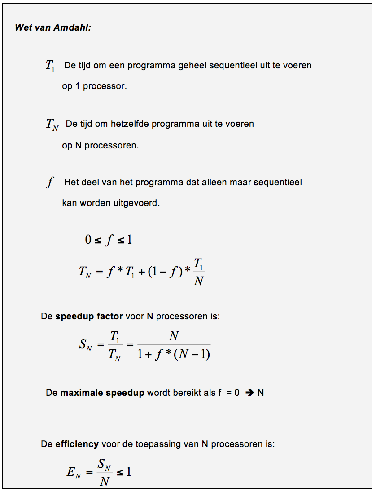
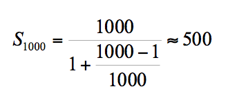

Exercise TDD: Amdahl
=========================
Resources
-------------
The following resources are convenient during the exercise:

* Sheets les 1.1: Week 1a - Developing distributed applications
* Sheets les 1.1: Week 1b – Maven
* Sheets les 1.2: Softwarekwaliteit JUnit

In this exercise you'll learn:
------------------------------
* how to apply the principles of TDD
* how to use the JUnit framework
* how to apply correct exception handling
* how to implement a simple Math formula in Java

Introduction
------------
Al in 1967 heeft Amdahl een formule geformuleerd die aangeeft hoeveel performancewinst (speedup factor) we kunnen bereiken met het toepassen van meerdere computers/CPU’s. We moeten dan weten:
* hoe groot het deel is van het totale programma, dat alleen maar sequentieel kan worden uitgevoerd;
* de hoeveelheid processoren die we ter beschikking hebben.

De genoemde wet van Amdahl is sterk vereenvoudigd. De overhead aan onderlinge communicatie is niet meegenomen. Dit betekent dat het in de praktijk nog ongunstiger is dan de uitkomst van deze wet aangeeft! In het algemeen geldt dat elke nieuw toegevoegde processor steeds minder bijdraagt aan de totale capaciteit van het systeem. Dit komt omdat steeds meer processorcapaciteit verloren gaat aan de noodzakelijke onderlinge communicatie.

Voorbeeld van de toepassing van de wet van Amdahl:
* een computer heeft 1000 CPU’s+
* het programma kan in maximaal 1000 parallel uit te voeren delen opgesplitst worden (kortom, het zijn allemaal single core CPU's)+
* 0.1% van het programma moet sequentieel uitgevoerd worden (bijvoorbeeld voor input en output).

De speedup factor is:

In dit geval is maar een speedup factor van 500 bereikt, in plaats van de maximaal mogelijke 1000, ondanks dat maar 0,1 % sequentieel moet worden uitgevoerd! De efficiency is daarmee 500/1000 = 50% van de maximale speedup.

OPGAVE
------
Pas de wet van Amdahl toe voor de volgende toepassing:
* Een computer heeft 1000 CPU’s
* Het programma kan in maximaal 1000 parallel uit te voeren delen opgesplitst worden.
* 1% van het programma moet sequentieel uitgevoerd worden.

Bereken de speedup factor en de efficiency voor de bovenstaande parameterwaarden. Voeg naar eigen inzicht nog enkele berekeningen toe voor andere waarden voor het deel van het programma dat sequentieel moet worden uitgevoerd.

Exercise 1
----------
Bereken het aantal zinvolle computers in een cluster. In een cluster met 4 computers wordt een bepaalde berekening uitgevoerd. Het blijkt dat met 4 computers in de cluster een snelheidwinst van 3x wordt behaald.

Dit betekent dat S4 = 3.
* Bereken f.
* Bereken de snelheidwinst voor het toepassen van 8, 16 en 64 computers in de cluster.
* Geef aan met welk aantal computers in een cluster het nog economisch zinvol is de berekening uit te voeren. Bereken daarvoor de volgende efficiency waarden: E4, E8 en E64.
* Is het nog zinvol om E128, E256 en E1024 uit te rekenen? Waarom?

Exercise 2
----------
Maak een Java console applicatie (geen GUI) die de wet van Amdahl kan evalueren voor gegeven parameterwaarden. Maak class methoden om de speedup factor en de efficiency te kunnen berekenen. Maak gebruik van het Mavenintro-project als opstart voor het gebruik van Ant en JUnit.

De aanpak moet op de TDD-manier (red, green, refactor: eerst de testcase, dan de code, dan herstructureren):
* maak eerst een Maven project
* maak eerst een class Amdahl met geschikte methoden zonder deze berekeningen in de methoden te implementeren. Zorg in elk geval voor geschikte methodenamen en parameterlijsten;
* maak de class AmdahlTest die JUnit testen kan uitvoeren of de berekeningen correct zijn. Gebruik daarvoor als testinvoer de gegevens uit exercise 1.

Beschrijf het testresultaat, zorg dat mvn test goed werkt.
* implementeer de berekeningen in de methoden van de class Amdahl en voer opnieuw de testen uit. Beschrijf het testresultaat.
* maak een class die een test suite representeert en neem hierin de test-case(s) voor Amdahl op;
indien onjuiste invoerwaarden voor de methoden worden gebruikt moet een IllegalArgumentException gegooid worden. Maak hiervoor geschikte testen.

Done
----
You can checkout the branch exercise-results for a working project and review possible differences.
