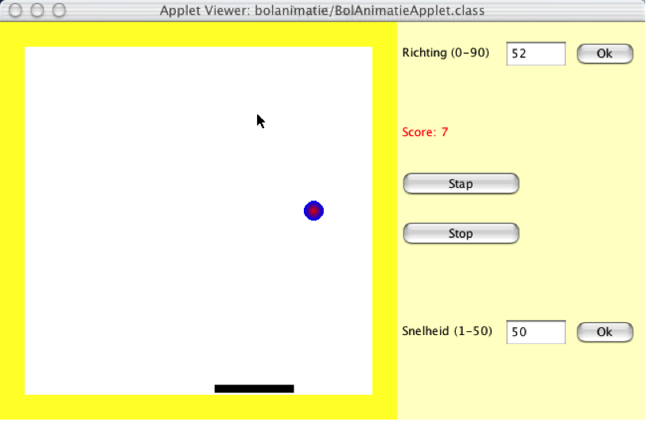

Exercise Threads : Bolanimatie
==============================
Resources
-------------
The following resources are convenient during the exercise:
* Sheets Threads
* Need more practical background and do you have a PluralSight account? As a HAN-OOSE student you can apply for an account at [ICA Xtend](https://ica-xtend.nl/winkel/):
	* http://www.pluralsight.com/courses/java2 (Threading)

In this exercise you'll learn:
------------------------------
* how to apply the Java Thread API
* how to use callbacks in Java to ensure threads are stopped
* how to handle exceptions properly
* how to change a simple Java Swing Applet

Introduction
------------
Doel van de workshop is inzicht te krijgen in het werken met Threads en de voorzichtigheid die daarbij nodig is. Daarnaast wordt er geoefend met Exceptions en het afvangen daarvan. Ook muisinteractie komt aan de orde. We doen dit aan de hand van een java-applet dat een eenvoudige animatie kan laten zien. We breiden deze uit tot een eenvoudig spelletje.

In deze workshop bouw je een simpel pong-spelletje: een balletjes stuitert over een speelveld. Aan de onderkant moet je het in het veld zien te houden met een batje.

De uitwerking kan er ongeveer zo uitzien:



Ook bij deze workshop is er startcode. De interface - inclusief het balletje - is al gegeven. Je moet zelf de Thread inbouwen die het balletje laat lopen, het met de muis beweegbare batje en (eventueel) de scoreteller.

Steps
-----
1. Open de startcode in jouw IDE via het pom.xml bestand. Als je IntelliJ gebruikt dan krijg je de vraag: "Open file or open as project", kies voor de laatste optie. In Eclipse kies je voor Open->Maven Project. Compileer en run het programma.

2. In het programma is een aantal functies al ingebouwd, zoals het stuiteren van het balletje, het instellen van de snelheid en hoek. Onderzoek hoe dit werkt en ga na hoe je deze functies in je eigen code kunt gebruiken.

3. Het is de bedoeling dat je een start/stop-knop in de Regelaar inbouwt. Als de gebruiker op Start klikt begint de animatie te lopen, het balletje begint over het speelveld te stuiteren. Het opschrift van de knop verandert in 'Stop'. De knop doet daarna wat erop staat, en verandert na een actie natuurlijk weer in 'Start'. Dit gaat met behulp van de volgende stappen:

  BolAnimatie
  * implementeert de interface ```Runnable```,
  * heeft een variabele van de klasse ```Thread``` en een ```boolean``` running die aangeeft of de animatie loopt,
  * Een methode ```run``` verplaatst in een loop (  while ( running )  ) het balletje en tekent opnieuw, bouw bij elke stap een pauze in,
  * methodes om de animatie te starten en te stoppen.
Regelaar krijgt één extra ```JButton``` om de animatie te starten en te stoppen.

4. De aanpak van de Threads bij het vorige onderdeel is nogal onveilig. Het is gemakkelijk om twee animatie-Threads te maken! Zet de snelheid van het balletje op 1, de pauze tussen twee verplaatsingen van het balletje is dan 1 seconde. Door snel na elkaar op Start/Stop te klikken kun je een tweede ```Thread``` maken, te herkennen aan het feit dat het balletje twee keer in een seconde wordt verplaatst. Probeer te verklaren waarom dit mogelijk is.

5. Door de volgende procedure kan een tweede Thread voorkomen worden. Imlementeer het volgende:
  * Bij het drukken op 'Stop' wordt de start/stop-knop disabled. Je dan dus (tijdelijk) niet weer op Start klikken.
  * Maak bij de ```Regelaar``` een methode ```threadHasStopped()``` aan. Deze moet de startknop knop weer actief maken. Als de ```Thread``` echt afloopt (eind van de ```run```-methode, na de while-loop), wordt deze methode aangeroepen.

6. Van dit programma kun je een eenvoudig spelletje maken. We doen dit door aan de onderkant van het speelveld een batje te tekenen dat je met de muis kunt verplaatsen. Dit is het batje waar de bal op stuitert. Als de bal naast het batje komt, vliegt deze uit het speelveld en moet de ```Thread``` stoppen.
  * Bouw in de paintmethode van ```BolAnimatie``` het tekenen van het batje in, op een variable x-positie.
  * Laat ```BolAnimatie``` de interface voor muisbewegingen implementeren en implementeer de methode ```mouseMoved``` om de positie van het batje te veranderen. Dit zorgt ervoor dat het batje van plaats verandert als de muis boven het speelveld beweegt. Zorg dat de klassen ```BolAnimatie``` ook daadwerkelijk naar de muisbeweging luistert (met zo'n ```addListener```-methode).

  Je vindt informatie over de benodigde klassen, interfaces en methoden in de API ```java.awt.event```.

  * Pas de methode voor het stuiteren van het balletje aan.
  * Zorg dat de ```Thread``` stopt als het balletje te ver naar beneden is.
  * Zorg voor een automatische reset (zet balletje in het midden) als de ```Thread``` start.


Done
----
You can checkout the branch exercise-results for a working project and review possible differences.
