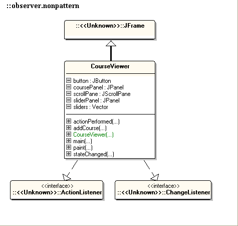
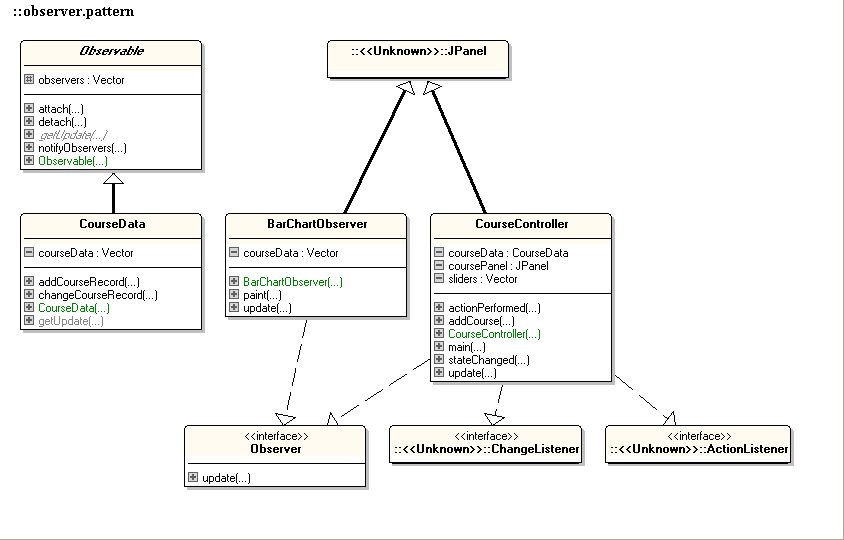

Exercise Observer : CourseViewer
================================
This exercise originally got posted on [University College of Dublin](http://csserver.ucd.ie/~meloc/DesignPatternJavaExercises/Observer/Observer.htm)
Resources
-------------
The following resources are convenient during the exercise:
* Sheets Observer Pattern
* Need more practical background and do you have a PluralSight account? As a HAN-OOSE student you can apply for an account by mailing @rodmidde:
	* http://www.pluralsight.com/courses/design-patterns-on-ramp (Observer)
	* http://www.pluralsight.com/courses/patterns-library (Observer)

In this exercise you'll learn:
------------------------------
* how to apply the Observer Pattern
* how to apply the Java API for Observer and Observable

Introduction
------------
The exercise involves the Observer Pattern. You can read more about this in the Design Patterns GoF textbook, or in the lecture notes.

We start by considering the task of graphically displaying data in different forms. In the program we look at below, we are given a group of JSliders from the javax.swing package and asked to depict the values of them in bar chart form.

This workshop provides you with starting code of two working programs called observer.nonpattern and observer.pattern. Both provide essentially the same functionality, but in different ways.

In the nonpattern version the bar chart graphical display for the group of JSliders is provided without using the Observer pattern. Its design is depicted in the following UML diagram (these diagrams may not be 100% accurate, so trust the code!):

This pattern version implements the same bar chart graphical display for the group of JSliders but this uses the Observer Design Pattern. A UML model of this code looks something like the following:

Play around with these programs and get a feeling for how they work. Note that the CourseController is also an Observer. This is because a CourseController needs to know when a new Course has been added (so as to create a new JSlider etc.). In this program a new Course can only be added through the CourseController, but in general it may happen in other ways as well, so the CourseController needs to be informed of this type of change.

Steps
-----
1. Exercise 1.1: Your problem is to extend the non-pattern version of the code above to depict the Vector of CourseRecords as a pie chart, as well as a bar chart. This is a hack job, so just try to get it working. Don't worry about making the code or the output look nice, just get it working any way you can. In you're not sure of the Swing details for drawing a pie chart, have a look at "How to draw a pie chart.txt" provided. Adjust the original paint-method so is fills an Integer-array with the current height of every slider and call the new paint-method with this array as a parameter. You'll end up having two paint-methods, that's fine for now.

  Note: The main point of Exercise 1.1 is to realise that this is a messy task. If you get bogged down, just move on to Exercise 1.2. You should definitely complete Exercise 1.2 in an elegant way by exploiting the Observer pattern. Time permitting,  move on to Exercises 1.3, 1.4 and 1.5 to experiment more with the pattern.

2. Exercise 1.2: Now extend the pattern version of the code above in the same way. This time exploit the flexibility of the Observer pattern. The PieChartObserver class needs to be created so that (1) it knows where the CourseData is, (2) it registers its interest in the CourseData , and (3) it handles updates from the CourseData correctly. Look at the BarChartObserver class for hints if you need to, but don't copy code blindly from this class; think about what's going on. You have two options when your PieChartObserver is ready:

  * replace the BarChartObserver with the PieChartObserver
  * add the PieChartObserver to the frame, just like BarChartObserver was added. You might have to play around with the contraints for being able to add it to the frame using a scrollPane as a wrapper.

3. Exercise 1.3: This version of the Observer pattern uses the pull model. notifyObservers() doesn't send any data with it; the observers pull the data from the subject and then display it. Update this to use the push model. In your new program, notifyObservers should push out all the data to all the observers. You may need to modify the PieChartObserver's constructor and only pass the relevant data (the Vector maybe?), also change the location of the addObserver from the PieChartObserver to the CourseController. The netto effect is that PieChartObserver doesn't need to know CourseData anymore!

4. Exercise 1.4: Consider what happens if your program has say 1000 courses. If one of these changes, notifyObservers() pushes all the data out to all the observers, even though only one slider has changed its value! Update your solution to 1.3 so it still uses the push model, but only pushes out the relevant data, i.e., the new value of the slider that has changed. (For this exercise, you can ignore the New Course change and continue to use the pull model for this type of update.)

Done
----
You can checkout the branch exercise-results for a working project and review possible differences.
