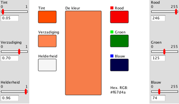
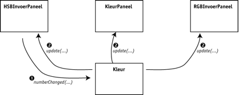

Exercise Observer-Observable: Kleurenmenger
===========================================
Resources
-------------
The following resources are convenient during the exercise:
* Sheets: Design Patterns, Observer-Observable
* Need more practical background and do you have a PluralSight account? As a HAN-OOSE student you can apply for an account by mailing @rodmidde:
	* http://www.pluralsight.com/courses/design-patterns-on-ramp (Observer)
	* http://www.pluralsight.com/courses/patterns-library (Observer)
	
In this exercise you'll learn:
------------------------------
* how to apply the Java observer API to decouple views and controllers from models
* how to adjust a simple Java Swing applet

Introduction
------------
Doel van de workshop is inzicht te krijgen in model-view-concept en het werken met de Java-klasse ```Observable``` en de interface ```Observer```. We doen dit aan de hand van een java-applet waarin kleuren gemengd worden.

In deze workshop bouw je een handige utility voor het vinden van de getalswaarden (RGB of HSB) van een kleur. De RGB-waarden worden ook hexadecimaal weergegeven, zodat je ze gemakkelijk in een html-pagina kunt gebruiken, bijvoorbeeld voor het zetten van de achtergrondkleur.



De startcode bij deze workshop bevat al een werkend programma, met de complete interface. De werking van het programma is echter niet helemaal goed.
Het probleem is het volgende: Wanneer je de kleur verandert in het ene invoerpaneel, verandert de kleur in het middenpaneel, maar de waarden in het andere invoerpaneel veranderen niet mee. Je kunt dit gemakkelijk testen: Als je de RGB-waarden op 255, 0, 0 (fel rood) zet, geeft het middenpaneel dit inderdaad weer. Schuif je daarna de tint naar blauw, dan blijft het rechterpaneel op de waarden 255, 0, 0 staan!

De oorzaak van de fout is dat de invoerpanelen veranderingen alleen doorgeven aan het kleurpaneel in het midden.


Het programma kan verbeterd worden door gebruik te maken van het Observable-Observer-patroon. Bedenk dat de twee invoerpanelen en het kleurpanelen feitelijk views zijn van een kleur. We maken een aparte klasse ```Kleur``` die de gegevens over de huidige kleur bijhoudt en de benodigde berekeningen uitvoert. De drie panelen worden ```Observers``` van deze klass. ```Kleur``` luistert naar veranderingen bij de schuivertjes en update de Observers na een verandering.



Steps
-----
1.Test de applet met behulp van een browser en ga na dat de werking niet helemaal in orde is (zie boven).
Importeer de broncode in de java-IDE die jij gebruikt. Let daarbij op de folders, die moeten overeenstemmen met de packages. Het programma zelf vormt de package kleurapplet, de broncode moet dus in een folder met die naam. De schuivertjes zitten in een subpackage: kleurapplet.grnuminput. Deze klassen moeten dus in een subfolder grnuminput in de folder kleurapplet. Compileer en run het programma.

Als je Eclipse gebruikt is het importeren van de source (.java) bestanden voldoende, bij Run… kun je indien nodig de Applet selecteren die gerund moet worden.

2.Maak de nieuwe klasse ```Kleur```, die het ‘model’ voor de kleur wordt. Deze klasse:
  *is een uitbreiding van ```Observable```
  * onthoudt gegevens over de huidige kleur en voert omrekeningen uit. De meeste code kun je knippen uit de klasse KleurPaneel
  * implementeert de interface ```NumberListener``` om te luisteren naar input van de schuivertjes. (Ook dit wordt nu gedaan door ```KleurPaneel```, daar kan dus het een en ander weg!)
  * heeft get-methodes, waarmee de Observers informatie over de huidige kleur kunnen opvragen

3.```KleurPaneel```, ```HSBInvoerPaneel``` en ```RGBInvoerPaneel``` moeten ```Observer``` worden van de ```Kleur```. Als de kleur verandert, worden de gekleurde vlakjes aangepast en de schuivers correct ingesteld. Elk van deze drie klassen:
  * implementeert de interface ```Observer```
  * meldt zich aan als ```Observer``` bij ```Kleur```
  * onthoudt zelf niets van de kleur (wanneer informatie nodig is wordt een getmethode van ```Kleur``` aangeroepen)

  NB: je kunt een schuiver instellen op een waarde met de methode ```setValue(double v)```. Er is al een methode om de drie schuivers tegelijk in te stellen.

4.Pas de setup in de klasse ```KleurApplet``` aan. (daar moet o.a. een instantie van ```Kleur``` gemaakt worden).

Done
----
You can checkout the branch exercise-results for a working project and review possible differences.
